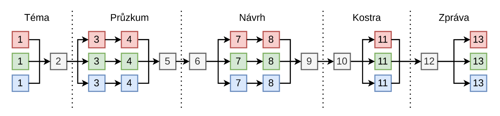
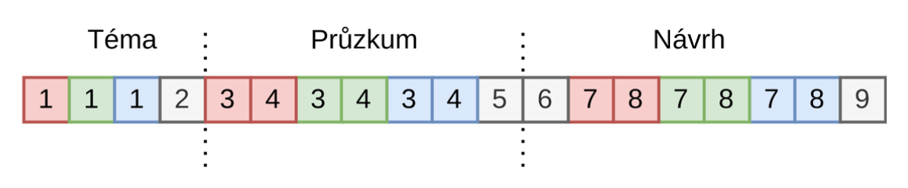

## Diagram vývoje

## Diagram zprávy

### Obsah zprávy

**Téma**:

- [ ] ==**Každý člen**==
  - Zpráva o návrhu: **popište** Vámi navržené **téma** a uveďte zdůvodnění tématu ve formě naplnění konkrétních uživatelských potřeb.
- [ ] **==Všichni členové týmu==**
  - Zpráva o návrhu: stačí uvést **vybrané téma** a zdůvodnění.

**Průzkum:**

- [ ] **==Každý člen==**
  - Zpráva o návrhu: uveďte **dotazník** ve formě jednotlivých otázek, poznatky získané z odpovědí, analýzu těchto odpovědí s důrazem na potřeby uživatelů a klíčových problémů.
- [ ] **==Každý člen==**
  - Zpráva o návrhu: krátce **popište** Vámi nalezenou **existující aplikaci**, její přednosti a nedostatky; jak se vaše budoucí aplikace bude inspirovat přednostmi a jak bude řešit nedostatky.
- [ ] **==Všichni členové týmu==**
  - Zpráva o návrhu: uveďte **klíčové potřeby uživatelů,** uživatelské procesy (jak uživatelé postupují) a klíčové **vlastnosti vaší budoucí aplikace**, které budou tyto potřeby řešit.

**Návrh:**

- [ ] **==Všichni členové týmu==**
  - Zpráva o návrhu: jasně uveďte **rozdělení práce** (kdo bude na čem pracovat) a pro jaký způsob rozdělení práce jste se rozhodli (1 nebo 2).
- [ ] **==Každý člen==**
  - Zpráva návrhu: krátce popište jak **váš návrh řeší potřeby uživatelů** (odkazujte se na bod 5), maketu reprezentujte pomocí obrázků, diagramů nebo snímků obrazovky a vhodného krátkého popisu.
- [ ] **==Každý člen==**
  - Zpráva o návrhu: popište **použité metriky** a proveďte jejich **vyhodnocení**, popište testovací úlohy/scénáře, vložte informace o testovaných subjektech, popište, jak probíhalo testování, jaké nedostatky odhalilo, a vámi navržené řešení těchto nedostatků.
- [ ] **==Všichni členové==**
  - Zpráva o návrhu: popis **architektury celé aplikace** (části FE a BE*) s ohledem na návrhový vzor MVC (nebo obdobný), popis datového modelu (datové struktury, hlavní funkce a metody), definice API (ne všechny funkce, jen ty klíčové), seznam vybraných technologií a nástrojů (pro FE i BE) včetně stručného zdůvodnění jejich výběru.
